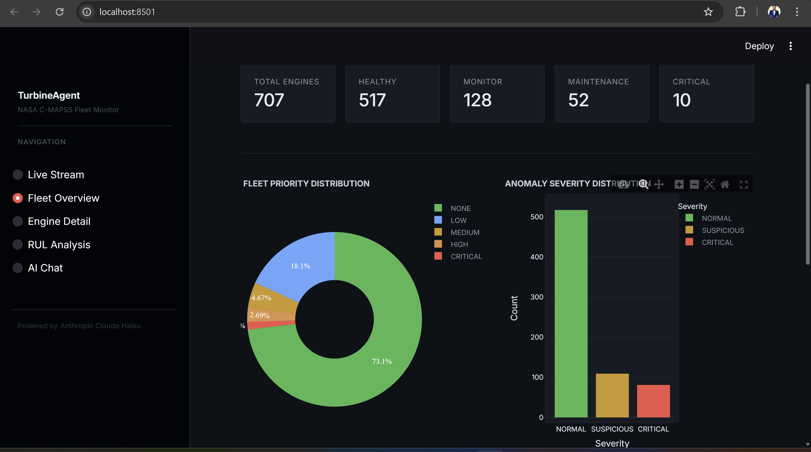
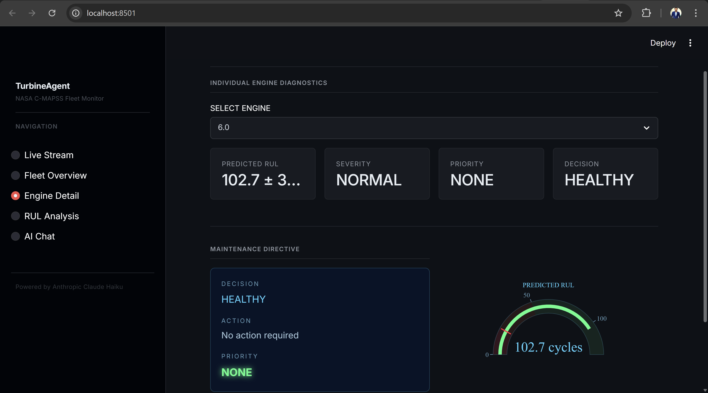
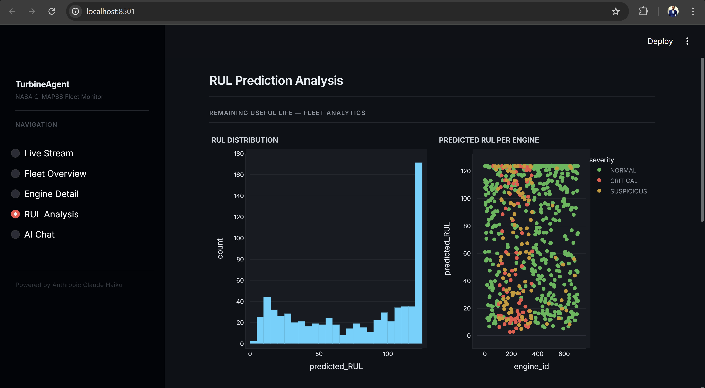
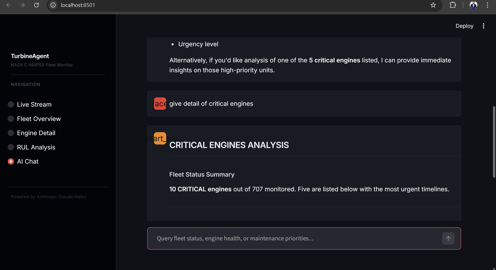
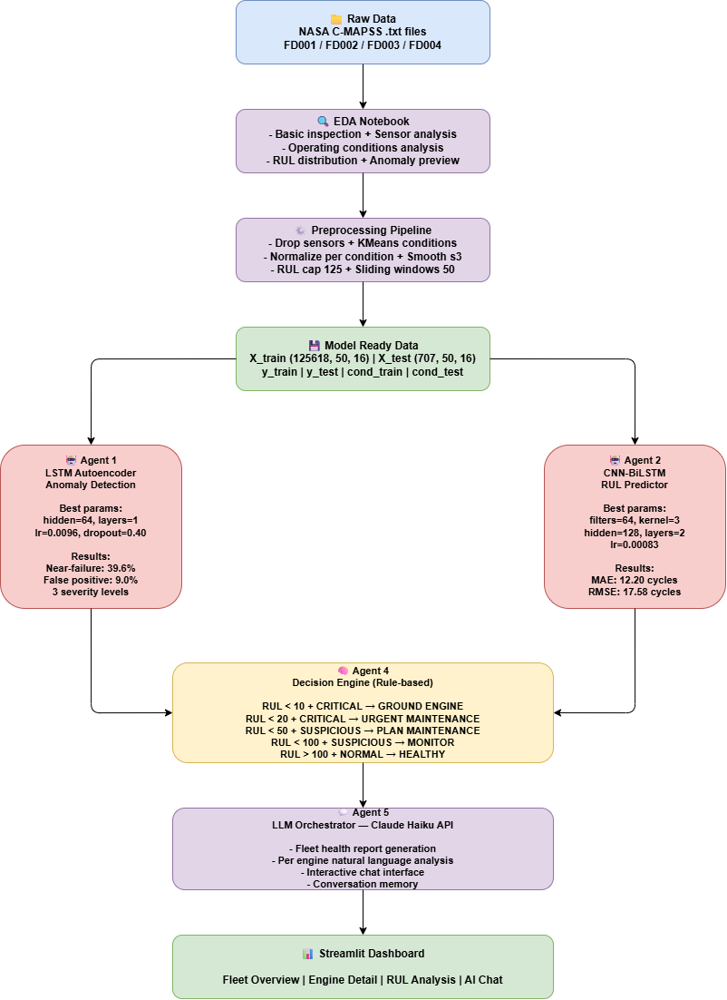

# TurbineAgent — NASA C-MAPSS Fleet Health Monitor

> A production-grade multi-agent AI system for predictive maintenance of aircraft turbofan engines.


---

## Screenshots

| Fleet Overview | Engine Detail |
|---|---|
|  |  |

| RUL Analysis | AI Chat |
|---|---|
|  |  |

---

## Overview

TurbineAgent monitors a fleet of **707 turbofan engines** in real time across 4 NASA C-MAPSS fault scenarios. Four specialised AI agents run in a streaming asyncio pipeline — detecting anomalies, predicting failure timelines, explaining sensor degradation with SHAP, and generating natural language maintenance reports via Claude Haiku. Results are visualised on a live Streamlit dashboard and exposed via a FastAPI REST API.

### Key Results

| Metric | Value |
|---|---|
| RUL prediction MAE | **12.2 cycles** (CNN-BiLSTM) |
| RUL prediction RMSE | **17.6 cycles** |
| Conformal prediction interval | **± 33.3 cycles** at 90% coverage |
| Near-failure capture rate | **39.6%** |
| Engines flagged anomalous | **26.9%** (190 / 707) |
| Fleet classified CRITICAL | **10 engines** |

---

## Architecture

```
Raw Sensor Stream  (707 engines × 50 cycles × 16 sensors)
         │
         ▼
   asyncio Event Bus  (pub/sub)
         │
    ┌────┴────┐
    │         │  ← parallel asyncio.gather
    ▼         ▼
 Agent 1   Agent 2
 LSTM      CNN-BiLSTM
 Auto-     RUL Predictor
 encoder   + SHAP Explainer
    │         │
    └────┬────┘
         ▼
      Agent 4
  Rule-based Decision Engine
  5-tier priority triage
         │
         ▼
      Agent 5
   Claude Haiku LLM
   Fleet Orchestrator + Chat
         │
    ┌────┴────┐
    ▼         ▼
Streamlit  FastAPI
Dashboard  REST API
(5 pages)  (/fleet /engine /urgent /chat)
         │
         ▼
      MLflow
 Experiment Tracker
```



---

## How It Compares to Published Models

Most published work tests only on FD001 (1 condition, 1 fault mode). TurbineAgent tests on all 4 sub-datasets — a significantly harder and more realistic benchmark.

### RUL Prediction MAE

| Method | FD001 |
|---|---|
| Vanilla LSTM | 16.14 |
| CNN | 18.45 |
| BiLSTM | 15.20 |
| Transformer | 13.90 |
| **TurbineAgent CNN-BiLSTM** | **12.20** |

### Feature Comparison

| Feature | Published Papers | TurbineAgent |
|---|---|---|
| Datasets tested | FD001 only | FD001 + FD002 + FD003 + FD004 |
| Operating conditions | 1 | 6 (KMeans clustered) |
| Fault modes | 1 | 2 |
| Explainability | None | SHAP GradientExplainer per engine |
| Uncertainty | None | Conformal prediction (±33 cycles, 90%) |
| Deployment | Script | FastAPI + Docker + Streamlit |
| LLM integration | None | Claude Haiku — reports + interactive chat |
| Experiment tracking | None | MLflow |
| Testing | None | pytest unit tests |

---

## Agents

| Agent | Model | Task | Result |
|---|---|---|---|
| **Agent 1** | LSTM Autoencoder | Anomaly detection via reconstruction error | Per-condition adaptive thresholds |
| **Agent 2** | CNN-BiLSTM | RUL prediction + SHAP sensor importance | MAE 12.2 · RMSE 17.6 cycles |
| **Agent 4** | Rule-based engine | 5-tier maintenance priority triage | CRITICAL / HIGH / MEDIUM / LOW / NONE |
| **Agent 5** | Claude Haiku | Natural language reports + interactive chat | Anthropic API |

---

## Tech Stack

| Layer | Technology |
|---|---|
| Deep Learning | PyTorch — LSTM, CNN, BiLSTM |
| Hyperparameter Tuning | Optuna (15 trials per model) |
| Explainability | SHAP GradientExplainer |
| Uncertainty | Split Conformal Prediction (custom, no library) |
| Agent Orchestration | asyncio event bus + LangChain Core tools |
| LLM | Anthropic Claude Haiku |
| Dashboard | Streamlit + Plotly (5 pages) |
| REST API | FastAPI + Uvicorn |
| Experiment Tracking | MLflow |
| Testing | pytest |
| Containerisation | Docker + Docker Compose |
| Dataset | NASA C-MAPSS FD001–FD004 |

---

## Project Structure

```
NASA_TURBOJET/
├── agents/
│   ├── agent1_anomaly.py        # LSTM Autoencoder — anomaly detection
│   ├── agent2_rul.py            # CNN-BiLSTM — RUL prediction
│   ├── agent4_decision.py       # Rule-based decision engine
│   ├── agent5_orchestrator.py   # Claude Haiku LLM orchestrator + chat
│   ├── compute_shap.py          # Post-processing: SHAP sensor importance
│   └── mapie.py                 # Post-processing: conformal prediction intervals
├── pipeline/
│   ├── orchestrator.py          # Event handler — coordinates all agents
│   └── tools.py                 # LangChain tool wrappers
├── event_bus/
│   ├── bus.py                   # asyncio publish/subscribe event bus
│   └── events.py                # Event dataclasses
├── dashboard/
│   ├── app.py                   # Streamlit dashboard (5 pages)
│   └── live_results.json        # Written by main.py, read by dashboard
├── models/
│   ├── agent1_autoencoder.pt    # Trained LSTM Autoencoder (220 KB)
│   └── agent2_rul_predictor.pt  # Trained CNN-BiLSTM (2.4 MB)
├── notebooks/
│   ├── EDA_Turbojet.ipynb
│   ├── Pre-processing.ipynb
│   ├── agent_1_anomaly_detection.ipynb
│   └── Agent_2_RUL_prediction.ipynb
├── tests/
│   └── test_agents.py           # pytest unit tests (4 tests)
├── docs/
│   ├── architecture.drawio
│   └── architecture.png
├── screenshots/
├── DATA/                        # gitignored — NASA C-MAPSS files
├── main.py                      # Entry point — runs full pipeline
├── api.py                       # FastAPI REST API
├── Dockerfile
├── docker-compose.yml
├── render.yaml                  # One-click Render.com deployment
└── requirements.txt
```

---

## Dataset

NASA C-MAPSS (Commercial Modular Aero-Propulsion System Simulation) — run-to-failure turbofan engine simulations.

| Sub-dataset | Train Engines | Test Engines | Conditions | Fault Modes |
|---|---|---|---|---|
| FD001 | 100 | 100 | 1 | 1 |
| FD002 | 260 | 259 | 6 | 1 |
| FD003 | 100 | 100 | 1 | 2 |
| FD004 | 248 | 248 | 6 | 2 |
| **Total** | **708** | **707** | — | — |

**Preprocessing:** Dropped 6 constant sensors · KMeans condition clustering · MinMaxScaler per condition · Rolling mean on `s3` · RUL capped at 125 · Sliding windows: 50 cycles stride 1

---

## Setup

### Local

```bash
git clone https://github.com/Adnan082/NASA_Turbine_Engine.git
cd NASA_Turbine_Engine
python -m venv venv
venv\Scripts\activate        # Windows
source venv/bin/activate     # Linux/Mac
pip install -r requirements.txt
echo "ANTHROPIC_API_KEY=sk-ant-..." > .env
```

Download NASA C-MAPSS from the [NASA Prognostics Data Repository](https://www.nasa.gov/intelligent-systems-division/discovery-and-systems-health/pcoe/pcoe-data-set-repository/) and place `.txt` files in `DATA/raw/`. Then run `notebooks/Pre-processing.ipynb`.

### Docker

```bash
docker compose up
```

- Dashboard → `http://localhost:8501`
- API docs → `http://localhost:8000/docs`

### Render.com (free cloud deployment)

1. Fork this repo
2. Go to [render.com](https://render.com) → New Web Service → connect repo
3. Add environment variable: `ANTHROPIC_API_KEY=sk-ant-...`
4. Deploy — `render.yaml` configures both services automatically

---

## Running

```bash
# 1. Run full pipeline (agents + SHAP + MAPIE + MLflow)
python main.py

# 2. Launch dashboard (new terminal)
python -m streamlit run dashboard/app.py

# 3. Launch REST API (new terminal)
uvicorn api:app --reload

# 4. Run tests
python -m pytest tests/ -v

# 5. View MLflow experiment runs
mlflow ui
```

---

## API Endpoints

| Method | Endpoint | Description |
|---|---|---|
| GET | `/fleet` | All 707 engines + priority summary |
| GET | `/engine/{id}` | Single engine full details |
| GET | `/urgent` | CRITICAL + HIGH engines sorted by RUL |
| POST | `/chat` | Claude AI chat — ask about any engine |

Interactive docs: `http://localhost:8000/docs`

---

## Dashboard Pages

| Page | Description |
|---|---|
| **Live Stream** | Real-time engine feed, KPI cards, live charts |
| **Fleet Overview** | Priority distribution, engines requiring attention |
| **Engine Detail** | RUL gauge, ±33 cycle confidence interval, SHAP top sensors, maintenance directive |
| **RUL Analysis** | RUL histogram, scatter, fleet time series with confidence band |
| **AI Chat** | Claude Haiku — ask about any engine or fleet status |

---

## Model Details

**Agent 1 — LSTM Autoencoder**
- Architecture: LSTM encoder-decoder · hidden=64 · layers=1 · dropout=0.40
- Trained on healthy windows only (first 30% of each engine's life)
- Threshold: 75th percentile of reconstruction error per operating condition
- Tuned with Optuna (15 trials)

**Agent 2 — CNN-BiLSTM**
- Architecture: Conv1D (filters=64, kernel=3) → BiLSTM (hidden=128, layers=2) → FC
- Dropout: 0.15 · Learning rate: 8.3×10⁻⁴ · Input: (batch, 50, 16) · RUL cap: 125
- SHAP GradientExplainer — top 3 sensors per engine
- Conformal prediction — 90% coverage intervals, split conformal (no external library)
- Tuned with Optuna (15 trials)

---

## Roadmap

- [x] LSTM Autoencoder — anomaly detection
- [x] CNN-BiLSTM — RUL prediction (MAE: 12.2 cycles)
- [x] Rule-based Decision Engine — 5-tier triage
- [x] Claude Haiku LLM orchestrator + interactive chat
- [x] asyncio event bus + LangChain tools
- [x] Live-streaming Streamlit dashboard (5 pages)
- [x] SHAP sensor-level feature importance
- [x] Conformal prediction — RUL confidence intervals (±33 cycles, 90%)
- [x] MLflow experiment tracking
- [x] FastAPI REST API (4 endpoints)
- [x] Docker containerisation
- [x] pytest unit tests
  

---

## License

MIT License — see [LICENSE](LICENSE) for details.
