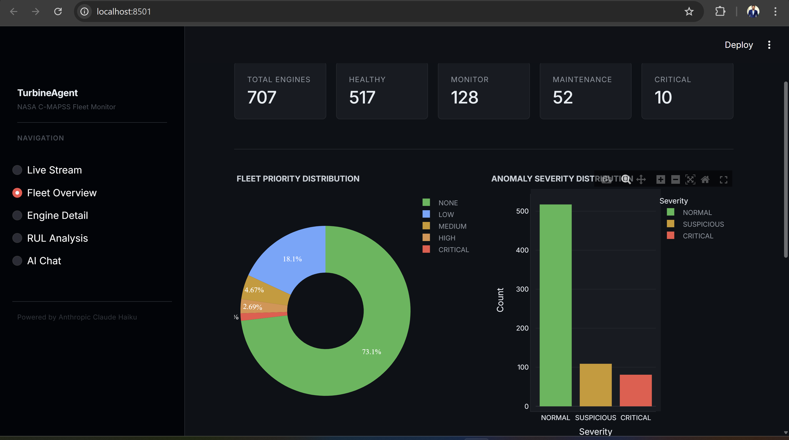
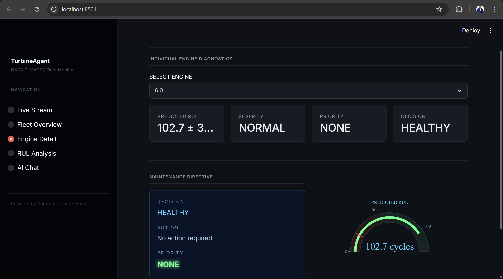
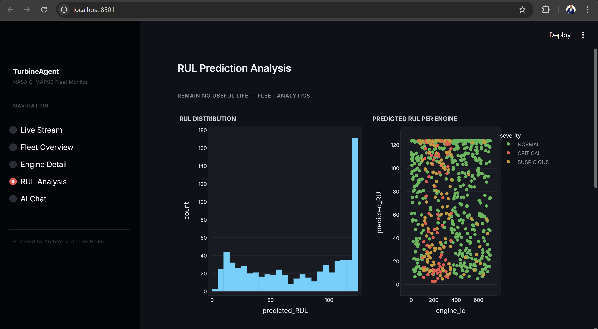
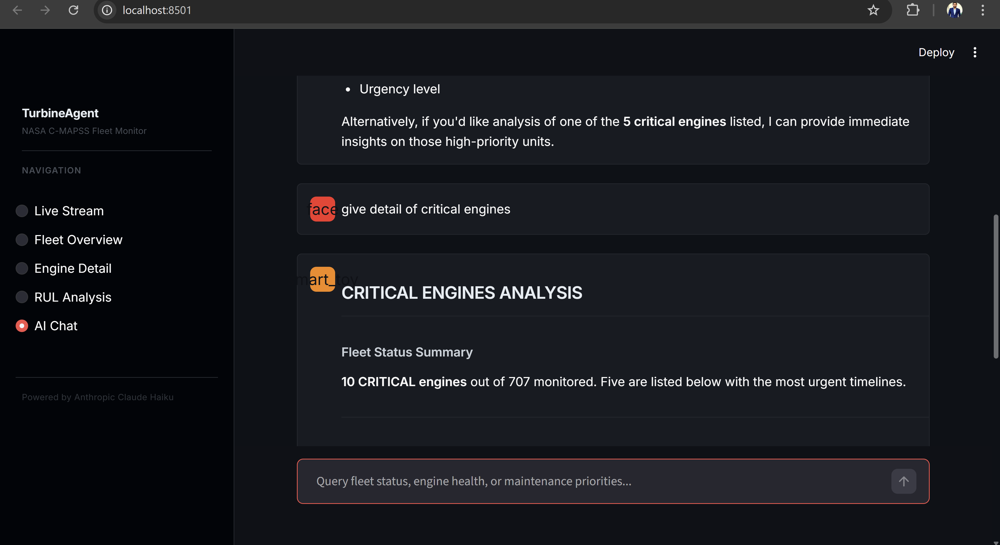
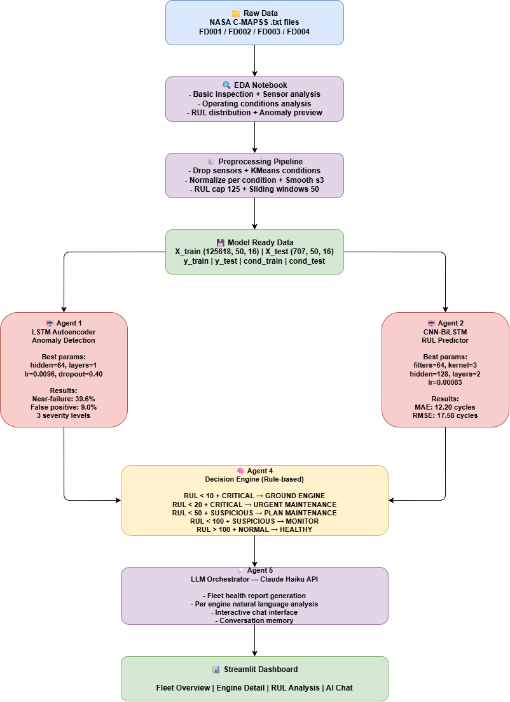

# TurbineAgent — NASA C-MAPSS Fleet Health Monitor

> A multi-agent AI system for predictive maintenance of aircraft turbofan engines.


---

## Screenshots

| Fleet Overview | Engine Detail |
|---|---|
|  |  |

| RUL Analysis | AI Chat |
|---|---|
|  |  |

---

## Overview

TurbineAgent monitors a fleet of **707 turbofan engines** in real time across the 4 NASA C-MAPSS sub-datasets (FD001–FD004, spanning 6 operating conditions and 2 fault modes between them). Four specialised AI agents run in a streaming asyncio pipeline — detecting anomalies, predicting failure timelines, explaining sensor degradation with SHAP, and generating natural language maintenance reports via Claude Haiku. Results are visualised on a live Streamlit dashboard and exposed via a FastAPI REST API.

### Key Results

| Metric | Value |
|---|---|
| RUL prediction MAE | **12.2 cycles** (CNN-BiLSTM) |
| RUL prediction RMSE | **17.6 cycles** |
| Conformal prediction interval | **± 33.3 cycles** (90% target, 92.9% observed — see [Known limitations](#known-limitations)) |
| Near-failure capture rate | **39.6%** |
| Engines flagged anomalous | **26.9%** (190 / 707) |
| Fleet classified CRITICAL | **10 engines** |

The numbers above are v1 (the deployed dashboard model). A corrected v2 calibration and retrain does
better on point-prediction accuracy and interval width — see
[v2: calibration on held-out training engines](#v2-calibration-on-held-out-training-engines).

---

## Architecture

```
Raw Sensor Stream  (707 engines × 50 cycles × 16 sensors)
         │
         ▼
   asyncio Event Bus  (pub/sub)
         │
    ┌────┴────┐
    │         │  ← parallel asyncio.gather
    ▼         ▼
 Agent 1   Agent 2
 LSTM      CNN-BiLSTM
 Auto-     RUL Predictor
 encoder   + SHAP Explainer
    │         │
    └────┬────┘
         ▼
      Agent 4
  Rule-based Decision Engine
  5-tier priority triage
         │
         ▼
      Agent 5
   Claude Haiku LLM
   Fleet Orchestrator + Chat
         │
    ┌────┴────┐
    ▼         ▼
Streamlit  FastAPI
Dashboard  REST API
(5 pages)  (/fleet /engine /urgent /chat)
         │
         ▼
      MLflow
 Experiment Tracker
```



---

## Feature Comparison

A lot of published C-MAPSS work reports results on FD001 only (1 operating condition, 1 fault mode) rather than
all four sub-datasets. This project evaluates on all 707 test engines across FD001–FD004. We haven't
independently reproduced the published baselines below, so this table compares *scope*, not accuracy —
see [Reproduce](#reproduce) and `reports/v1/metrics.json` for our own MAE/RMSE/NASA-score numbers instead
of a cross-paper comparison, which is easy to get wrong by comparing mismatched metrics (e.g. MAE vs RMSE).

| Feature | Typical FD001-only baseline | TurbineAgent |
|---|---|---|
| Datasets tested | FD001 only | FD001 + FD002 + FD003 + FD004 |
| Operating conditions | 1 | 1 (FD001/FD003) or 6, KMeans-clustered (FD002/FD004) |
| Fault modes | 1 | 1 (FD001/FD002) or 2 (FD003/FD004) |
| Explainability | None | SHAP GradientExplainer per engine |
| Uncertainty | None | Conformal prediction (±33 cycles, ~93% empirical coverage — see [Known limitations](#known-limitations)) |
| Deployment | Script | FastAPI + Docker + Streamlit |
| LLM integration | None | Claude Haiku — reports + interactive chat |
| Experiment tracking | None | MLflow |
| Testing | None | pytest unit tests + CI |

---

## Agents

| Agent | Model | Task | Result |
|---|---|---|---|
| **Agent 1** | LSTM Autoencoder | Anomaly detection via reconstruction error | Per-condition adaptive thresholds |
| **Agent 2** | CNN-BiLSTM | RUL prediction + SHAP sensor importance | MAE 12.2 · RMSE 17.6 cycles |
| **Agent 4** | Rule-based engine | 5-tier maintenance priority triage | CRITICAL / HIGH / MEDIUM / LOW / NONE |
| **Agent 5** | Claude Haiku | Natural language reports + interactive chat | Anthropic API |

---

## Tech Stack

| Layer | Technology |
|---|---|
| Deep Learning | PyTorch — LSTM, CNN, BiLSTM |
| Hyperparameter Tuning | Optuna (15 trials per model) |
| Explainability | SHAP GradientExplainer |
| Uncertainty | Split Conformal Prediction (custom, no library) |
| Agent Orchestration | asyncio event bus + LangChain Core tools |
| LLM | Anthropic Claude Haiku |
| Dashboard | Streamlit + Plotly (5 pages) |
| REST API | FastAPI + Uvicorn |
| Experiment Tracking | MLflow |
| Testing | pytest |
| Containerisation | Docker + Docker Compose |
| Dataset | NASA C-MAPSS FD001–FD004 |

---

## Project Structure

```
NASA_TURBOJET/
├── agents/
│   ├── agent1_anomaly.py        # LSTM Autoencoder — anomaly detection
│   ├── agent2_rul.py            # CNN-BiLSTM — RUL prediction
│   ├── agent4_decision.py       # Rule-based decision engine
│   ├── agent5_orchestrator.py   # Claude Haiku LLM orchestrator + chat
│   ├── compute_shap.py          # Post-processing: SHAP sensor importance
│   └── mapie.py                 # Post-processing: conformal prediction intervals
├── pipeline/
│   ├── orchestrator.py          # Event handler — coordinates all agents
│   └── tools.py                 # LangChain tool wrappers
├── event_bus/
│   ├── bus.py                   # asyncio publish/subscribe event bus
│   └── events.py                # Event dataclasses
├── dashboard/
│   ├── app.py                   # Streamlit dashboard (5 pages)
│   └── live_results.json        # Written by main.py, read by dashboard
├── models/
│   ├── agent1_autoencoder.pt    # Trained LSTM Autoencoder (220 KB)
│   └── agent2_rul_predictor.pt  # Trained CNN-BiLSTM (2.4 MB)
├── notebooks/
│   ├── EDA_Turbojet.ipynb
│   ├── Pre-processing.ipynb
│   ├── agent_1_anomaly_detection.ipynb
│   └── Agent_2_RUL_prediction.ipynb
├── tests/
│   └── test_agents.py           # pytest unit tests (4 tests)
├── docs/
│   ├── architecture.drawio
│   └── architecture.png
├── screenshots/
├── DATA/                        # gitignored — NASA C-MAPSS files
├── main.py                      # Entry point — runs full pipeline
├── api.py                       # FastAPI REST API
├── Dockerfile
├── docker-compose.yml
├── render.yaml                  # One-click Render.com deployment
└── requirements.txt
```

---

## Dataset

NASA C-MAPSS (Commercial Modular Aero-Propulsion System Simulation) — run-to-failure turbofan engine simulations.

| Sub-dataset | Train Engines | Test Engines | Conditions | Fault Modes |
|---|---|---|---|---|
| FD001 | 100 | 100 | 1 | 1 |
| FD002 | 260 | 259 | 6 | 1 |
| FD003 | 100 | 100 | 1 | 2 |
| FD004 | 248 | 248 | 6 | 2 |
| **Total** | **708** | **707** | — | — |

**Preprocessing:** Dropped 6 constant sensors · KMeans condition clustering · MinMaxScaler per condition · Rolling mean on `s3` · RUL capped at 125 · Sliding windows: 50 cycles stride 1

---

## Setup

### Local

```bash
git clone https://github.com/Adnan082/NASA_Turbine_Engine.git
cd NASA_Turbine_Engine
python -m venv venv
venv\Scripts\activate        # Windows
source venv/bin/activate     # Linux/Mac
pip install -r requirements.txt
echo "ANTHROPIC_API_KEY=sk-ant-..." > .env
```

Download NASA C-MAPSS from the [NASA Prognostics Data Repository](https://www.nasa.gov/intelligent-systems-division/discovery-and-systems-health/pcoe/pcoe-data-set-repository/) and place `.txt` files in `DATA/raw/`. Then run `notebooks/Pre-processing.ipynb`.

### Docker

`docker-compose.yml` requires a `.env` file (both services load it via `env_file`). Copy the example first:

```bash
cp .env.example .env   # then fill in ANTHROPIC_API_KEY
docker compose up
```

- Dashboard → `http://localhost:8501`
- API docs → `http://localhost:8000/docs`

### Render.com (free cloud deployment)

1. Fork this repo
2. Go to [render.com](https://render.com) → New Web Service → connect repo
3. Add environment variable: `ANTHROPIC_API_KEY=sk-ant-...`
4. Deploy — `render.yaml` configures both services automatically

---

## Reproduce

The v1 model checkpoints (`models/agent1_autoencoder.pt`, `models/agent2_rul_predictor.pt`) are
committed, but `DATA/model_ready/*.npy` is gitignored — a fresh clone can't run anything until
it's rebuilt from the committed parquet files in `DATA/pre_processed_data/`.

```bash
pip install -r requirements.txt
python scripts/prepare_data.py     # rebuild DATA/model_ready/*.npy (make prepare)
python scripts/evaluate_rul.py     # reproduce MAE 12.20 / RMSE 17.58 / 92.9% coverage (make evaluate)
python -m pytest tests/ -q         # data checks + metric regression tests (make test)
```

`scripts/prepare_data.py` is a script version of `notebooks/Pre-processing.ipynb` and is checked
against the committed arrays with `np.allclose` in `tests/test_data.py`. See `FIX_REPORT.md` for
what else changed to make this reproducible and where the numbers above come from.

---

## Running

```bash
# 1. Run full pipeline (agents + SHAP + MAPIE + MLflow)
python main.py

# 2. Launch dashboard (new terminal)
python -m streamlit run dashboard/app.py

# 3. Launch REST API (new terminal)
uvicorn api:app --reload

# 4. Run tests
python -m pytest tests/ -v

# 5. View MLflow experiment runs
mlflow ui
```

---

## API Endpoints

| Method | Endpoint | Description |
|---|---|---|
| GET | `/fleet` | All 707 engines + priority summary |
| GET | `/engine/{id}` | Single engine full details |
| GET | `/urgent` | CRITICAL + HIGH engines sorted by RUL |
| POST | `/chat` | Claude AI chat — ask about any engine |

Interactive docs: `http://localhost:8000/docs`

---

## Dashboard Pages

| Page | Description |
|---|---|
| **Live Stream** | Real-time engine feed, KPI cards, live charts |
| **Fleet Overview** | Priority distribution, engines requiring attention |
| **Engine Detail** | RUL gauge, ±33 cycle confidence interval, SHAP top sensors, maintenance directive |
| **RUL Analysis** | RUL histogram, scatter, fleet time series with confidence band |
| **AI Chat** | Claude Haiku — ask about any engine or fleet status |

---

## Model Details

**Agent 1 — LSTM Autoencoder**
- Architecture: LSTM encoder-decoder · hidden=64 · layers=1 · dropout=0.40
- v1 is trained on **all** training windows (125,618 of them), not just healthy ones — see
  [Known limitations](#known-limitations) for what that costs in false positives
- Threshold: 75th percentile of reconstruction error per operating condition
- Tuned with Optuna (15 trials)

**Agent 2 — CNN-BiLSTM**
- Architecture: Conv1D (filters=64, kernel=3) → BiLSTM (hidden=128, layers=2) → FC
- Dropout: 0.15 · Learning rate: 8.3×10⁻⁴ · Input: (batch, 50, 16) · RUL cap: 125
- SHAP GradientExplainer — top 3 sensors per engine
- Conformal prediction — 90% coverage intervals, split conformal (no external library)
- Tuned with Optuna (15 trials)

---

## Known limitations

Numbers here are traceable to `reports/v1/metrics.json` and `reports/v2/metrics.json`, both written by
committed scripts (`scripts/evaluate_rul.py`, `scripts/evaluate_v2.py`) — see [Reproduce](#reproduce).

**Fixed for v2:**
- **Conformal calibration set was test data.** v1 calibrated on "the last 20% of `X_test`"
  (`agents/mapie.py`) — because of file concatenation order this slice is FD004 only, and it's part of
  the set used for final evaluation, so the design wasn't exchangeable even though observed coverage
  (92.9%) happened to be fine. v2 calibrates on a held-out 20% of the *training* engines instead
  (`scripts/prepare_calibration_split.py`), never touching the test set until evaluation. See the
  [v2: calibration on held-out training engines](#v2-calibration-on-held-out-training-engines) section.
- **Not reproducible from a clone.** The notebooks used Colab/Google Drive paths and `DATA/model_ready/`
  was gitignored with no way to rebuild it. `scripts/prepare_data.py` now rebuilds it from the committed
  parquet files, verified bit-for-bit identical to the original notebook output.
- **Anomaly detector (Agent 1) was weak, and regime labels collided across sub-datasets.** v1 trains on
  all 125,618 windows (not "healthy only", despite an earlier README claim) with a 75th-percentile
  in-sample threshold that flags ~25% of healthy windows by construction, and its condition labels merge
  four physically different regimes into "condition 0" (FD001 and FD003 are both hardcoded to 0). v2
  trains on early-life windows only, gives every sub-dataset's regimes a unique label (`FD002_r3`), and
  calibrates its threshold for a 5% false-alarm rate on held-out data — see
  [v2: anomaly detector trained on early life](#v2-anomaly-detector-trained-on-early-life). **v1's
  deployed agent is unchanged**; this is a documented alternative, not a swap.

**Still open (v1 behaviour, unchanged in the current default agents):**
- **No validation set or early stopping for v1.** The Optuna search (15 trials, 10% subsample) minimised
  *training* loss with no held-out validation data, so the reported hyperparameters were picked without
  any check against overfitting. v2's retrain adds a validation split and early stopping for the RUL
  model; the v1 checkpoint itself hasn't been retrained.

---

## v2: calibration on held-out training engines

v1's conformal calibration set was "the last 20% of `X_test`" — because of file order that's FD004 only,
and it's part of the data used for final evaluation (see [Known limitations](#known-limitations)). v2
fixes this properly: the CNN-BiLSTM is retrained (same v1 hyperparameters, no re-tuning) on 510 of the 709
training engines, with a held-out validation slice for early stopping, and calibrated on the other 142
training engines — one prediction per engine, at a random cut point in its life. The 707 test engines are
evaluated exactly once, at the end, having never been touched by training or calibration. Every number
below is written by `scripts/evaluate_v2.py` to `reports/v2/metrics.json`.

Training stopped early at epoch 13 (patience 10, CPU-only) rather than running the full 100 epochs v1 used
with no validation set at all.

**Point prediction — v1 (all 709 engines, 100 epochs, no validation) vs v2 (510 engines, early-stopped):**

| Sub-dataset | v1 RMSE | v2 RMSE | v1 MAE | v2 MAE | v1 NASA score | v2 NASA score |
|---|---|---|---|---|---|---|
| FD001 | 16.98 | **13.25** | 12.21 | **9.58** | 810 | **323** |
| FD002 | 18.05 | **13.52** | 12.86 | **9.47** | 2126 | **1037** |
| FD003 | **14.52** | 14.97 | **9.93** | 10.24 | **602** | 952 |
| FD004 | 18.43 | **14.60** | 12.42 | **10.29** | 2841 | **1586** |
| **Pooled** | 17.58 | **14.08** | 12.20 | **9.88** | — | — |

v2 is better everywhere except FD003, where it's slightly worse on every metric, including a notably
higher NASA score (952 vs 602) driven by a handful of late (over-)predictions that the asymmetric NASA
score penalises heavily. Reported as-is, not smoothed over.

**Conformal calibration:**

| | v1 | v2 (split-conformal) |
|---|---|---|
| Calibration set | last 20% of test set (142 engines, FD004 only) | 142 held-out **training** engines, all 4 sub-datasets |
| Interval | ± 33.3 cycles | **± 27.8 cycles** |
| Evaluated on | 565 test engines (the rest weren't calibration data) | **all 707** test engines |
| Coverage (target 90%) | 92.9% | 92.8% |

v2's interval is ~17% narrower at essentially the same marginal coverage — and unlike v1, it can honestly
report coverage on the full test set, because calibration never touched it.

**Coverage by true-RUL band (v2, split-conformal)** — v1 never measured this:

| RUL band | n | Coverage | Mean width |
|---|---|---|---|
| 0–30 | 159 | 100.0% | 45.4 |
| 31–60 | 114 | 93.9% | 55.1 |
| 61–100 | 177 | **82.5%** | 49.6 |
| >100 | 257 | 94.9% | 36.9 |

Marginal coverage (92.8%) hides real unevenness: the 61–100 band is under the 90% target despite the
pooled number looking fine. This is a real limitation of a single pooled quantile, not a bug — it's
exactly why we checked band-level coverage instead of stopping at the marginal number.

**Mondrian (group-conditional) conformal, by predicted-RUL band** — tried per Phase 3's "if time allows":
quantiles are computed separately per band of the model's own prediction, using each band's own
calibration engines.

| | Split-conformal | Mondrian |
|---|---|---|
| Marginal coverage | 92.8% | 89.1% |
| Mean width | 44.9 | **36.2** |
| RUL 61–100 coverage | 82.5% | 72.9% (worse) |
| RUL 0–30 coverage / width | 100.0% / 45.4 | 96.2% / **22.5** |

Mondrian gives a much tighter interval for engines the model thinks are near end-of-life, but its overall
marginal coverage falls *below* the 90% target and the already-weak 61–100 band gets worse, not better —
that band has only 29 calibration engines, so its quantile is a noisy estimate. We're reporting this as an
experiment, not adopting it as the default: **the split-conformal ±27.8 cycles is the v2 headline number**,
Mondrian is a documented alternative with a real trade-off, not a strict improvement.

---

## v2: anomaly detector trained on early life

v1's autoencoder (Agent 1) is trained on all 125,618 training windows — not "healthy windows only" as an
earlier README claimed — and its threshold (75th percentile of its own training error, per condition)
flags ~25% of healthy windows by construction, on top of merging four different physical regimes into
"condition 0" (see [Known limitations](#known-limitations)). v2 fixes both:

- Trained only on **early-life windows** (the first 30% of each engine's life) from the same 510
  fit-train engines used in the RUL retrain (`scripts/prepare_anomaly_v2_data.py`)
- Regimes are unique across sub-datasets (`FD002_r3`, not just `3`) — 14 regimes instead of 6
- Threshold picked per regime for a **5% false-alarm rate**, measured on held-out early-life windows from
  the 142 calibration engines (achieved 5.2%), instead of an arbitrary 75th percentile on its own training
  data

Numbers from `scripts/evaluate_anomaly_v2.py`, saved to `reports/v2/anomaly_metrics.json`:

| RUL band | v1 flag rate | v2 flag rate |
|---|---|---|
| ≤ 30 (near failure) | 39.6% | **56.6%** |
| 31–60 | — | 24.6% |
| 61–100 | — | 10.2% |
| > 100 (healthy) | 19.5% | **5.4%** |

v2 is a clear improvement in both directions: it catches *more* near-failure engines (56.6% vs 39.6%) while
raising *far fewer* false alarms on healthy ones (5.4% vs 19.5%, close to the 5% target it was calibrated
for). For "RUL ≤ 30", precision is 0.60 and recall is 0.57 (150/707 engines flagged overall, vs 190/707 for
v1). v1's threshold and behaviour are unchanged in the deployed agent — this is a documented alternative,
not a swap.

---

## Roadmap

- [x] LSTM Autoencoder — anomaly detection
- [x] CNN-BiLSTM — RUL prediction (MAE: 12.2 cycles)
- [x] Rule-based Decision Engine — 5-tier triage
- [x] Claude Haiku LLM orchestrator + interactive chat
- [x] asyncio event bus + LangChain tools
- [x] Live-streaming Streamlit dashboard (5 pages)
- [x] SHAP sensor-level feature importance
- [x] Conformal prediction — RUL confidence intervals (±33 cycles, 90%)
- [x] MLflow experiment tracking
- [x] FastAPI REST API (4 endpoints)
- [x] Docker containerisation
- [x] pytest unit tests
  

---

## License

MIT License — see [LICENSE](LICENSE) for details.
